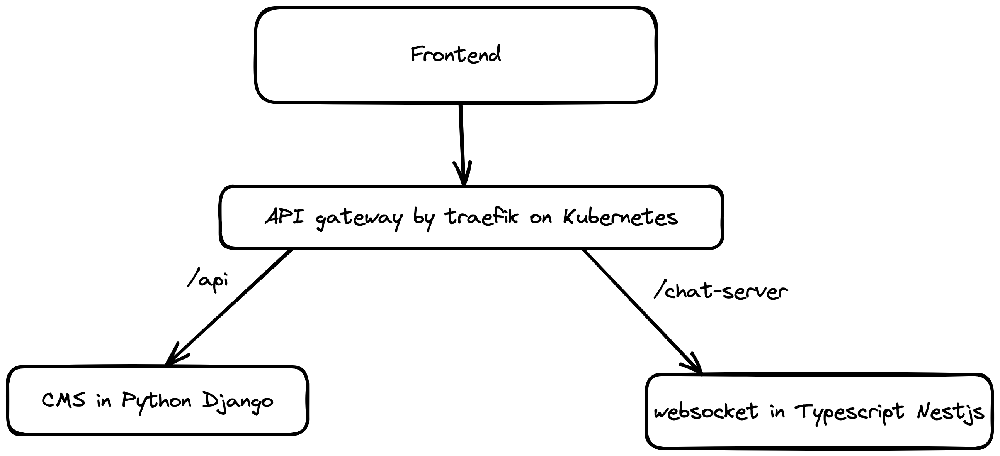

# freeyeti.net - chat server

## Description

By Nestjs, Socket.io, Redis, Elasticsearch



* Backend (CMS and YetiBe): [https://github.com/Jianxuan-Li/yetien-backend](https://github.com/Jianxuan-Li/freeyeti-backend)
* Frontend: https://github.com/Jianxuan-Li/freeyeti-frontend-nextjs

## Installation

```bash
$ pnpm install
```

## Running the app

* `./dev up` to start development docker containers
* `pnpm run start` to start the app
* `./dev down` to stop development docker containers

* `pnpm run start:dev` watch mode
* `pnpm run start:prod` production mode

## Test

* `pnpm run test` unit tests
* `pnpm run test:e2e` e2e tests
* `pnpm run test:cov` test coverage

## License

MIT licensed
